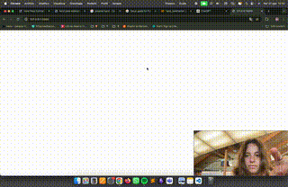
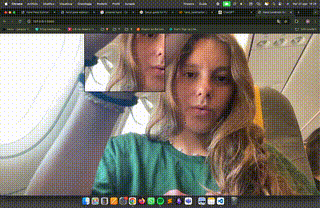
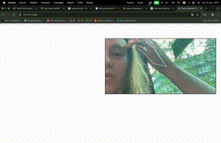
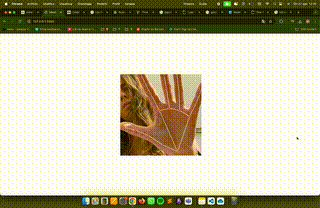
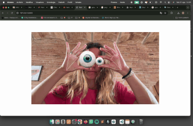

# hand_camera

```
git clone https://github.com/matildee3/hand_camera.git
pip install Flask opencv-python mediapipe numpy
cd hand_camera
```

## hand1 


```
cd hand1
python app.py
```



## hand2-0


```
cd hand2-0
python app.py
```



## hand2-1 


```
cd hand2-1
python app.py
```



## hand3 


```
cd hand3
python app.py
```




## hand4


```
cd hand4
python app.py
```


